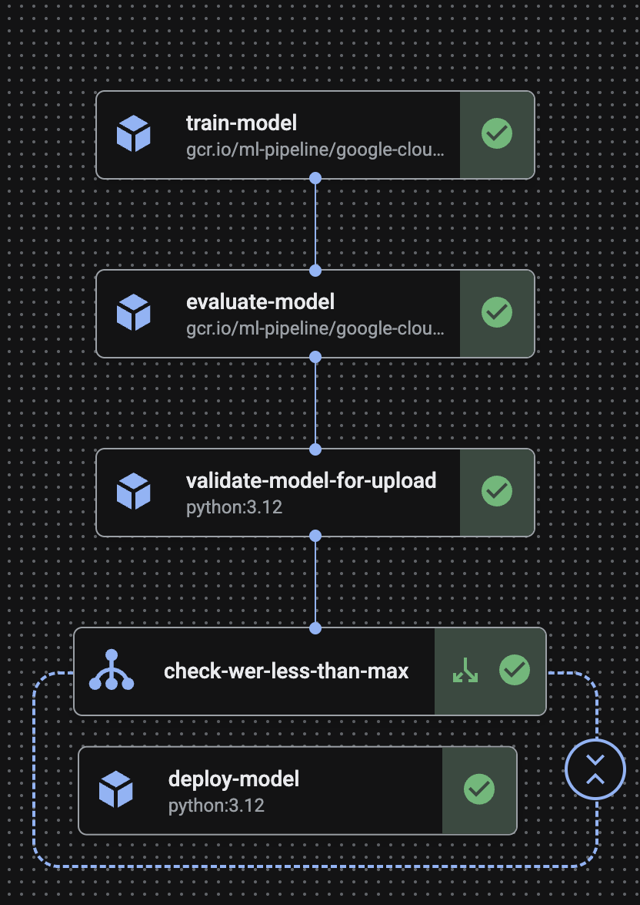

This project fine-tunes the Google HAI-DEF [MedASR](https://developers.google.com/health-ai-developer-foundations/medasr) model for Automatic Speech Recognition (ASR) in English using the [Eka Medical ASR Evaluation Dataset](https://huggingface.co/datasets/ekacare/eka-medical-asr-evaluation-dataset).

The fine-tuning, evaluation and deployment are contained within a Vertex AI Pipeline written using the Kubeflow Pipelines
(KFP) SDK.

This training script is primarily based on the Hugging Face MedASR fine-tuning example: https://github.com/google-health/medasr/blob/main/notebooks/fine_tune_with_hugging_face.ipynb. It has been refactored into a comprehensive MLOps pipeline (encompassing training, evaluation, and deployment) for Vertex AI, utilizing design patterns from the GCP MLOps demo: https://github.com/meken/gcp-mlops-demo.

## Folder structure

```text
├── src/trainer/
│   └── __init__.py
│   └── task.py       # Main script for data processing and model training and evaluation.
│   └── pipeline.py   # KFP Pipeline definition
├── submit.py  # Script to trigger the Vertex AI Pipeline job
```

## Description

The training logic is in the `trainer/task.py` script, which automates the process of:

1. Downloading the Eka Medical ASR Evaluation Dataset from HF Hub.
2. Preprocessing the audio and text data.
3. Fine-tuning the MedASR model.
4. Evaluating the model using the Word Error Rate (WER) metric.

The `pipeline.py` script defines the following workflow:

1. Model training using the logic in `trainer/task.py`.
2. Model evaluation using the logic in `trainer/task.py`.
3. Model upload and deployment conditional on the achieved WER metric not surpassing a specified threshold.

### Vertex AI usage

1. The model is trained and evaluated using a **custom-built container image** which packages `trainer/task.py` and its dependencies, via a **Vertex AI Training** custom job.
2. The model artifacts are imported into the **Vertex AI Model Registry**.
3. The model is deployed to a **Vertex AI Prediction** endpoint, using the Google-provided MedASR inference container image `us-docker.pkg.dev/deeplearning-platform-release/vertex-model-garden/health-ai-medasr.1-0` that uses the NVIDIA Triton Inference Server and specifically its PyTorch backend to execute the model.



## Steps to run the Vertex AI Pipeline

### Prerequisites

- **Google Cloud Account**: Get started by following the instructions on the Google Cloud documentation website: https://docs.cloud.google.com/docs/get-started
- **gcloud**: Install gcloud by following the instructions on the Google Cloud documentation website: https://docs.cloud.google.com/sdk/docs/install-sdk.
- **uv**: Install uv by following the instructions on the official uv website: https://docs.astral.sh/uv/getting-started/installation/.
- **Git**: Ensure you have git installed. If not, you can download it from https://git-scm.com/ and follow the installation guide.

### 1. Setup repo

**1.1 Clone the repository:**

```bash
git clone https://github.com/janeyasmin/med-asr-finetune-vertexai.git
cd med-asr-finetune-vertexai
```

**1.2 Install dependencies with uv:**

```bash
uv sync --only-dev
```

**1.3 Activate the uv shell:**

```bash
source .venv/bin/activate
```

**1.4 Authenticate the Google Cloud CLI, Client Libraries and enable Google Cloud APIs:**

```bash
gcloud auth login
gcloud auth application-default login

PROJECT_ID=<YOUR_PROJECT_ID>
gcloud config set project $PROJECT_ID

gcloud services enable aiplatform.googleapis.com \
    cloudbuild.googleapis.com \
    artifactregistry.googleapis.com
```

### 2. Build the model training image

**2.1. Set environment variables:**

```bash
REGION=us-central1
REPO_NAME="custom-med-asr-finetune"
IMAGE_NAME="medasr"
TRAINING_IMAGE_URI="${REGION}-docker.pkg.dev/${PROJECT_ID}/${REPO_NAME}/${IMAGE_NAME}:latest"
```

**2.2. Create an Artifact Registry repository:**

```bash
gcloud artifacts repositories create $REPO_NAME \
      --repository-format=docker \
      --location=$REGION
```

**2.3. Build the container image with Cloud Build and push the image to Artifact Registry:**

```bash
gcloud builds submit --region=$REGION --tag=$TRAINING_IMAGE_URI
```

### 3. Run the pipeline

**3.1 Configure access to the Hugging Face Hub and `google/medasr` repo:**

- Generate a Hugging face `read` access token by going to [settings](https://huggingface.co/settings/tokens).

- Request access to the `google/medasr` gated model by going to the [repo](https://huggingface.co/google/medasr).

**3.2. Compile the pipeline:**

```bash
python3 -m src.trainer.pipeline
```

**3.3. Set environment variables:**

**Rename the ".env.example" file to ".env" and fill the below values:**

```bash
# Token to access MedASR Gated Model repo. Make sure the token has read access.
HF_TOKEN='YOUR_VALUE_HERE'

# Vertex AI config
GOOGLE_CLOUD_PROJECT_ID='YOUR_VALUE_HERE'
GOOGLE_CLOUD_LOCATION='YOUR_VALUE_HERE' # e.g. us-central1


# GCS location for model artifacts
GCS_BUCKET_URI='YOUR_VALUE_HERE' # gs://your-bucket-name

# Artifact Registry location for training and inference container images
TRAINING_IMAGE_URI='YOUR_VALUE_HERE' # this is the container image that you built in the previous step
SERVING_IMAGE_URI='us-docker.pkg.dev/deeplearning-platform-release/vertex-model-garden/health-ai-medasr.1-0:model-garden.health-ai-medasr-release_20251215.02_p0'

# Model training config
NUM_TRAIN_EPOCHS='YOUR_VALUE_HERE' # numerical value, e.g. 35

# Model validation config
MAX_WER_DEPLOYMENT='YOUR_VALUE_HERE' # numerical value from 0-1
```

**3.4 Submit the asynchronous Vertex AI Pipelines run job:**

```bash
python3 submit.py
```

## Send a request to the Vertex AI endpoint for the deployed model

### 1. Prepare test audio file:

```bash
python3 -c "import base64, json; print(json.dumps({'file': base64.b64encode(open('./tests/audio.wav', 'rb').read()).decode()}))" > request.json

```

### 2. Send a request:

```bash
VERTEX_AI_LOCATION=<YOUR_VALUE_HERE> # e.g. us-central1
PROJECT_ID=<YOUR_PROJECT_ID>
ENDPOINT_LOCATION=<YOUR_VALUE_HERE> # e.g. us-central1
ENDPOINT_ID=<YOUR_VALUE_HERE>

curl -X POST \
-H "Authorization: Bearer $(gcloud auth print-access-token)" \
-H "Content-Type: application/json" \
"https://${VERTEX_AI_LOCATION}-aiplatform.googleapis.com/v1/projects/${PROJECT_ID}/locations/${ENDPOINT_LOCATION}/endpoints/${ENDPOINT_ID}:rawPredict" \
--data-binary @request.json
```

**Sample response:**

```bash
{
  "text": "Hello, the patient has fever, headache, body ache uh all over the body and uh this is also so much happening I recommend him to do antigen test uh I am suspectingdinguo and uh the patient should take uh dose 650. Uh the patient should take uh Pentom DSR40</s>"
}
```
